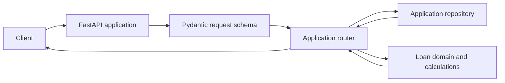
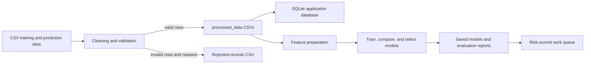

# LoanServe

LoanServe is a Python loan-servicing and risk-analysis project. It combines a loan application API, lending calculations and validation, data preparation and default-risk models, customer-message processing, policy-document search, and a tool-using customer-support assistant.

This repository is a backend and data-processing project; it does not include a web frontend. The API can be explored through FastAPI's generated documentation.

## What It Does

- Accepts loan applications, validates applicant details, prices loans, evaluates eligibility, and provides repayment schedules.
- Cleans historical and prediction datasets, preserves rejected rows with reasons, loads cleaned data into SQLite, and produces database reports.
- Trains and compares models that estimate default risk, chooses an operating threshold based on lending costs, and creates a queue of applications for review.
- Classifies, cleans, summarizes, and extracts information from customer messages; flags unsafe messages and identifies cases that need a person to review them.
- Searches lending policy documents by meaning and uses policy evidence and application tools to answer customer questions.

## Architecture And Flows

### Loan application request



The request schema checks fields such as PAN, mobile, email, loan type, and collateral requirements. The router stores or retrieves an application through a repository and uses the core domain code to compute the rate, installment, eligibility, rejection reasons, or repayment schedule. The default app factory uses an in-memory repository; it can instead be given a database URL to use the SQLAlchemy repository. The separate data-access database is used by the data workflows and assistant tools.

### Dataset and risk-model workflow



Cleaning is deliberately separate from model fitting: malformed or incomplete rows are recorded as rejected instead of silently dropped. The risk-model modules then prepare features, train models, evaluate them, and save predictions and review outputs.

### Customer messages and assistant

Customer-message workflows validate and clean text, classify category and urgency, extract dates, amounts, and application references, and may summarize threads or generate escalation reports. The assistant is a separate LangGraph workflow: it triages a question, plans and runs tools, drafts a response, and can pause for approval. Its current planner and response writer are deterministic Python code; although a risk-prediction tool exists, the planner does not currently select it. The workflow stores checkpoints in SQLite.

Policy search loads PDFs from `data/policy_documents/`, splits them into sections and chunks, embeds them, and stores the vectors in ChromaDB. Retrieval returns relevant passages, and separate helpers can validate passage citations; citation validation is not currently wired into the assistant graph.

## Repository Guide

For implementation details while working inside the package, see the [loanserve package index](loanserve/README.md) and its guides for [API](loanserve/api/README.md), [core domain](loanserve/core/README.md), [data access](loanserve/data_access/README.md), [risk models](loanserve/risk_models/README.md), [message intelligence](loanserve/message_intelligence/README.md), [retrieval](loanserve/retrieval/README.md), and [assistant](loanserve/assistant/README.md).

### Top-level files and folders

| Path | Purpose |
| --- | --- |
| `README.md` | This project, architecture, and operating guide. |
| `requirements.txt` | Python package dependencies. |
| `test.py` | Pytest suite covering calculations, APIs, data pipelines, models, messages, and retrieval. Pass it explicitly to pytest because its filename does not match pytest's usual `test_*.py` discovery pattern. |
| `config/constants.py` | Shared lending rules, model settings, API limits, paths, and validation patterns. |
| `scripts/day01_loan_eligibility.py` | Introductory interactive eligibility and repayment example. |
| `scripts/day02_loan_pricing.py` | Introductory pricing functions and `LoanApplication` example. |
| `data/` | Raw CSV inputs, message threads, policy PDFs, retrieval test cases, and the policy-document manifest. |
| `processed_data/` | Cleaned and feature-enriched datasets created by processing modules. |
| `database/` | SQLite application data and the persistent ChromaDB policy store. |
| `artifacts/` | Serialized trained models and other model artifacts used by later stages. |
| `output/` | Generated predictions, reports, evaluation results, queues, and logs. |
| `loanserve/` | The installable application package, organized by responsibility below. |

### `loanserve/api/`: HTTP service and persistence

| File | Responsibility |
| --- | --- |
| `application_factory.py` | Builds an isolated FastAPI app, installs middleware and handlers, configures repositories, and mounts routers. |
| `access_control.py` | Issues and verifies JWTs, enforces role restrictions, supports local open mode, and writes audit entries. |
| `middleware.py` | Implements request rate limiting and optional request logging. |
| `orm_models.py` | Defines SQLAlchemy database entities and session setup. |
| `password_hashing.py` | Hashes and verifies account passwords. |
| `repository.py` | Defines application persistence operations and provides in-memory and SQL-backed implementations. |
| `schemas.py` | Pydantic request/response contracts and input validation for applications, accounts, and assistant questions. |
| `routers/loan_applications.py` | Creates, lists, reads, replaces, and deletes applications; returns repayment schedules. |
| `routers/user_accounts.py` | Account signup and login endpoints. |
| `routers/assistant.py` | HTTP endpoint that passes a customer question into the assistant workflow. |
| `__init__.py` files | Mark the API and router directories as Python packages. |

### `loanserve/core/`: lending domain

| File | Responsibility |
| --- | --- |
| `entities.py` | Loan application domain classes, secured/unsecured specialization, pricing, eligibility, and product factory. |
| `loan_calculations.py` | Installment, debt-to-income, and outstanding-balance calculations. |
| `validators.py` | Normalizes and validates PAN, Indian mobile numbers, and email addresses. |
| `exceptions.py` | Shared LoanServe exception base and domain-specific errors. |
| `decorators.py` | Reusable calculation validation and execution-time measurement decorators. |
| `__init__.py` | Marks the core directory as a Python package. |

### `loanserve/data_access/`: files, cleaning, and database work

| File | Responsibility |
| --- | --- |
| `cleaning_pipeline.py` | Checks raw application rows, normalizes valid rows, writes cleaned datasets, and writes rejected rows with reasons. |
| `database_loader.py` | Loads cleaned application data into SQLite and supports lookup and deletion. |
| `database_reports.py` | Produces SQL summaries for default rate by product, yearly application volume, and city exposure. |
| `file_storage.py` | Reads and writes application CSV files and converts stored rows to domain objects. |
| `__init__.py` | Marks the data-access directory as a Python package. |

### `loanserve/risk_models/`: default-risk analytics

| File | Responsibility |
| --- | --- |
| `feature_pipeline.py` | Selects model columns, imputes and scales numeric inputs, encodes categories, and creates train/holdout splits. |
| `feature_engineering.py` | Adds installment/income and credit-band features, and measures feature lift by segment. |
| `baseline_model.py` | Trains, saves, loads, and applies the baseline default classifier. |
| `tree_models.py` | Builds and compares decision-tree and random-forest models, feature importances, and class-weight choices. |
| `champion_model.py` | Searches model settings, selects a champion, and chooses a decision threshold using the configured costs of lending errors. |
| `cross_validation.py` | Compares candidate models across folds and against a holdout set. |
| `work_queue.py` | Scores waiting applications and creates a prioritized review queue using the chosen threshold. |
| `__init__.py` | Marks the risk-model directory as a Python package. |

### `loanserve/message_intelligence/`: customer-message processing

| File | Responsibility |
| --- | --- |
| `text_cleaning.py` | Removes quoted replies, signatures, greetings, and sign-offs; masks URLs and identifying references. |
| `message_classifier.py` | Trains and applies text classifiers for message category and urgency. |
| `injection_guard.py` | Detects prompt-injection markers and scans a message corpus for unsafe input. |
| `entity_extraction.py` | Extracts application/ticket references, amounts, and dates, and checks references against the application database. |
| `batch_pipeline.py` | Validates and processes message batches, combines classification and extraction, and writes a results CSV. |
| `thread_summary.py` | Selects representative sentences to summarize customer message threads. |
| `escalation.py` | Combines urgency, sentiment, and exposure signals to report messages needing human attention. |
| `attention.py` | Provides the softmax and scaled dot-product attention calculations used in message analysis. |
| `llm_client.py` | Loads Gemini settings, validates model replies, and manages the response cache. |
| `__init__.py` | Marks the message-intelligence directory as a Python package. |

### `loanserve/retrieval/`: policy document search

| File | Responsibility |
| --- | --- |
| `document_loader.py` | Extracts text from policy PDFs. |
| `chunking.py` | Splits policy text into sections and bounded chunks without breaking words. |
| `vector_store.py` | Embeds chunks, builds/opens the persistent ChromaDB collection, and searches it. |
| `filtered_search.py` | Detects product context and applies metadata filters to policy searches. |
| `grounded_answer.py` | Builds evidence-based prompts and checks that citations refer to retrieved chunks. |
| `__init__.py` | Marks the retrieval directory as a Python package. |

### `loanserve/assistant/`: customer-support workflow

| File | Responsibility |
| --- | --- |
| `state.py` | Defines the data passed between assistant workflow steps and creates initial state. |
| `graph.py` | Connects workflow nodes and conditional routes into a LangGraph. |
| `nodes.py` | Implements triage, planning, tool execution, drafting, approval, critique, and response stages. |
| `agents.py` | Plans tool use and drafts or writes customer-facing responses. |
| `tools.py` | Implements installment calculation, application lookup, risk prediction, and policy search tools. |
| `workflow.py` | Runs the graph and persists thread checkpoints in SQLite. |
| `__init__.py` | Marks the assistant directory as a Python package. |

### Data and generated outputs

| Path | Contents |
| --- | --- |
| `data/loan_applications_train.csv` | Historical loan records used for cleaning and model training. |
| `data/loan_applications_predict.csv` | Applications to score after model training. |
| `data/customer_messages.csv` and `data/message_threads.csv` | Message corpus and threaded-message input. |
| `data/adversarial_messages.csv` | Messages used to evaluate injection detection. |
| `data/policy_documents/`, `data/policy_documents_manifest.json` | Policy PDFs and metadata used to describe/filter document chunks. |
| `data/retrieval_evaluation_set.json` | Questions and expected evidence for retrieval evaluation. |
| `processed_data/` | Cleaned training/prediction datasets, enriched datasets, and cleaned messages. |
| `artifacts/` | Saved baseline, champion, tree, and message-classifier models. |
| `database/loanserve.db` | SQLite database used by data and assistant tools. |
| `database/policy_store/` | Persistent ChromaDB vector index for policy chunks. |
| `output/` | Predictions, work queue, rejected rows, message results, and model/retrieval evaluation reports. |

Generated files can be rebuilt by the corresponding module. Some assistant workflows need several of these files to exist before they can run; the API health endpoint itself does not need model or Gemini setup.

## Setup

Run commands from the repository root. Python 3.11 or newer is recommended for the dependency versions in `requirements.txt`.

```bash
python3 -m venv .venv
source .venv/bin/activate
python -m pip install --upgrade pip
python -m pip install -r requirements.txt
```

The policy embedder may download a Sentence Transformers model the first time it is used. The `loanserve/message_intelligence/llm_client.py` helper can read `GEMINI_API_KEY` and `GEMINI_MODEL` from environment variables or `.env`, but the current assistant workflow does not make Gemini API calls. Keep credentials private and do not commit populated secrets.

## Run The API

Start the application from the repository root:

```bash
uvicorn loanserve.api.application_factory:create_application --factory --reload
```

Check that it responds:

```bash
curl http://127.0.0.1:8000/health
```

Expected response shape:

```json
{"status":"ok","applications":0}
```

Open `http://127.0.0.1:8000/docs` for interactive API documentation. The health endpoint is public. Application and assistant routes require a bearer token by default; accounts can be created and logged in through the user-account endpoints. For local-only experimentation, `LOANSERVE_OPEN_MODE=1` disables that route authorization. Do not enable open mode in a deployed environment.

Stop the server with `Ctrl+C`.

## Run The Learning Scripts

The first two scripts are standalone examples, separate from the API:

```bash
printf 'personal\n500000\n14\n36\n60000\n32\n' | python scripts/day01_loan_eligibility.py
python scripts/day02_loan_pricing.py
```

The first command supplies loan type, principal, annual rate, term, income, and age to the eligibility example. The second demonstrates reusable pricing functions and the loan application object.

## Run Data Pipelines

These modules have command-line entry points and use paths relative to the repository root. Run only the stages you need; model training and vector indexing can take considerably longer than the API smoke check.

| Command | Main result |
| --- | --- |
| `python -m loanserve.data_access.cleaning_pipeline` | Cleaned train/prediction CSVs and `output/rejected_records.csv`. |
| `python -m loanserve.data_access.database_loader` | Loads the cleaned training file into `database/loanserve.db`. Run cleaning first. |
| `python -m loanserve.risk_models.feature_engineering` | Enriched datasets and feature-lift report. |
| `python -m loanserve.risk_models.baseline_model` | Baseline model and predictions. Requires cleaned train and prediction files. |
| `python -m loanserve.risk_models.tree_models` | Tree-model artifacts and class-weight comparison. |
| `python -m loanserve.risk_models.champion_model` | Champion model, search report, and cost-selected threshold. |
| `python -m loanserve.risk_models.cross_validation` | Cross-validation scores. |
| `python -m loanserve.risk_models.work_queue` | A scored queue of waiting applications. Requires the champion model and threshold output. |
| `python -m loanserve.message_intelligence.message_classifier` | Trained category/urgency classifiers. |
| `python -m loanserve.message_intelligence.text_cleaning` | Cleaned customer-message corpus. |
| `python -m loanserve.message_intelligence.batch_pipeline` | Classified and extracted fields for a message batch. Requires the message model and application database. |
| `python -m loanserve.message_intelligence.thread_summary` | Thread summaries. |
| `python -m loanserve.message_intelligence.entity_extraction` | Extracted message entities and linked application references. Requires the application database. |
| `python -m loanserve.message_intelligence.injection_guard` | Injection-scan report. |
| `python -m loanserve.message_intelligence.escalation` | Escalation report. |
| `python -m loanserve.retrieval.vector_store` | Rebuilds the ChromaDB policy index from policy PDFs. Requires the embedding model to be available. |

Each command's exact inputs and output paths are also visible in the module's `if __name__ == "__main__"` block. Rebuilding a vector index replaces the existing policy collection.

## Run Tests

Run the repository's pytest suite explicitly:

```bash
python -m pytest -q test.py
```

For a smaller subset, select tests by name, for example:

```bash
python -m pytest -q test.py -k week1_day1
```

The suite includes unit and API tests, but it also checks generated datasets, models, and reports. If a test reports a missing generated file, run the pipeline responsible for that output (see the table above) and retry. The current assistant workflow does not require Gemini credentials; `GEMINI_*` settings are required only if code calls `llm_client.load_settings()`.

## Configuration And Safety Notes

Shared policy values and default paths live in `config/constants.py`. Relevant environment variables include:

| Variable | Purpose |
| --- | --- |
| `GEMINI_API_KEY`, `GEMINI_MODEL` | Settings read by the optional language-model helper; the current assistant graph does not call Gemini. |
| `LOANSERVE_OPEN_MODE=1` | Local development only: lets application and assistant routes run without bearer-token authorization. |
| `LOANSERVE_JWT_SECRET` | Overrides the development JWT signing key. Set a strong secret outside local development. |
| `LOANSERVE_AUDIT_LOG` | Overrides the audit-log destination. |
| `LOANSERVE_CHECKPOINTS` | Overrides the assistant workflow checkpoint database path. |

The JWT key in `config/constants.py` is explicitly a development default. Use a secret supplied by the deployment environment for any deployed service.