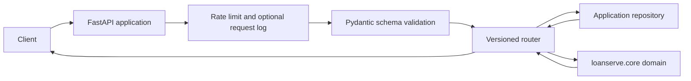

# API Package

`loanserve.api` exposes the LoanServe backend over HTTP with FastAPI. It owns request/response validation, route registration, access control, rate limiting, optional request logging, and persistence for applications created through the API.

## Request Flow



The factory installs a domain-error handler, CORS settings, app-scoped service objects, a per-client sliding-window limiter, and the routers. The application router validates a request with Pydantic, saves or retrieves a record through the repository interface, and calls `loanserve.core` to compute the priced response. The health endpoint is intentionally independent of authentication and model assets.

## Files

| File | Implementation |
| --- | --- |
| `application_factory.py` | `create_application()` creates a fresh app and its dependencies. With no `database_url`, it uses in-memory application storage; when a URL is supplied, it creates SQLAlchemy tables and a SQL repository. It mounts health, account, application, and optional assistant endpoints. |
| `schemas.py` | Defines Pydantic models for application input/output, pagination, schedules, accounts, tokens, and assistant questions. Input validators normalize PAN, mobile number, and email; secured products require positive collateral. |
| `routers/loan_applications.py` | Implements create/list/read/replace/delete operations and the repayment schedule route. It separates HTTP handling from domain pricing via `price_application()`. |
| `routers/user_accounts.py` | Provides `/api/v1/auth/signup` and `/api/v1/auth/login`. Passwords are hashed; login returns a JWT and records an audit event. The current account dictionary is app-memory state. |
| `routers/assistant.py` | Provides `/api/v1/assistant/ask`, which hands the question and optional thread ID to `run_assistant()`. |
| `repository.py` | Declares the application storage interface and implements it with either a Python dictionary or SQLAlchemy. Both implementations mint IDs and support filtered pagination and CRUD. |
| `orm_models.py` | Declares `Applicant` and `StoredApplication`; creates the SQLAlchemy engine/session factory and schema. |
| `access_control.py` | Creates/verifies signed JWTs, checks administrator-only operations, supports local open mode, and appends login audit entries. |
| `password_hashing.py` | Wraps password hash/verify operations using Argon2. |
| `middleware.py` | Implements a process-local sliding-window request limiter and optional append-only method/path/status/latency logger. |
| `routers/__init__.py`, `__init__.py` | Python package markers. |

## Routes

| Route | Purpose | Access |
| --- | --- | --- |
| `GET /health` | Returns `status` and application count. | Public |
| `POST /api/v1/auth/signup` | Registers a user. | Public |
| `POST /api/v1/auth/login` | Verifies credentials and returns a bearer token. | Public |
| `/api/v1/applications` | Create and list loan applications. | Bearer token unless local open mode is enabled |
| `/api/v1/applications/{application_id}` | Read, replace, or delete an application. | Bearer token unless local open mode is enabled; deletion is administrator-only by default |
| `/api/v1/applications/{application_id}/schedule` | Returns outstanding balance after each month. | Bearer token unless local open mode is enabled |
| `POST /api/v1/assistant/ask` | Runs an assistant question through the workflow. | Bearer token unless local open mode is enabled |

FastAPI's generated OpenAPI document is available at `/docs` while the server is running.

## Storage And Runtime Notes

- The default factory uses `InMemoryApplicationRepository`; its applications disappear when the process restarts. Pass `database_url` to `create_application()` to use the API's SQLAlchemy repository.
- The API's ORM database is distinct from `loanserve.data_access.database_loader.ApplicationDatabase`, which stores cleaned CSV data for reporting and assistant lookups.
- User accounts are currently stored in `app.state.user_accounts`, an in-memory dictionary, even when SQL application storage is configured.
- Rate-limit counters are local to the process and client address. They are not a distributed rate limiter.
- The request logger is installed only when `request_log_path` is provided to the factory.
- `LOANSERVE_OPEN_MODE=1` bypasses authorization for application and assistant routes. It is for local experimentation only. Configure `LOANSERVE_JWT_SECRET` outside development; `config/constants.py` contains a development-only default.

## Run And Check

From the repository root, after installing `requirements.txt`:

```bash
uvicorn loanserve.api.application_factory:create_application --factory --reload
curl http://127.0.0.1:8000/health
```

`test.py` exercises the API through FastAPI's test client, including CRUD behavior, authentication, roles, rate limiting, and SQL-backed repository behavior. Run it from the repository root with `python -m pytest -q test.py`.
