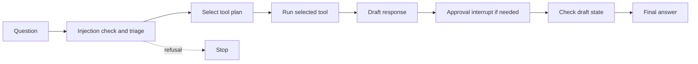

# Assistant Package

`loanserve.assistant` connects customer questions to LoanServe tools through a LangGraph state machine. The HTTP adapter is in `loanserve.api.routers.assistant`; the workflow here owns triage, planning, tool dispatch, drafting, approval gating, critique, and final response state.

## Runtime Flow



The typed `AssistantState` carries the question, messages, step names, category/urgency, plan, tool outputs, draft, citations, confidence, approval fields, refusal, and answer. Nodes return only state updates; LangGraph merges them and routes based on refusal state. `run_assistant()` opens a SQLite checkpointer, uses the thread ID to identify conversation state, invokes the graph, and reports whether an interrupt is waiting for approval.

## Files

| File | Implementation |
| --- | --- |
| `state.py` | Defines the TypedDict contract and creates a fresh initial state for a question. Message and step fields use LangGraph reducers to accumulate updates. |
| `graph.py` | Registers triage, plan, tools, draft, approval, critic, and respond nodes; conditional edges stop processing after a refusal. |
| `nodes.py` | Checks prompt-injection markers and short questions; uses the message classifier for category/urgency when available; runs a selected tool; drafts; interrupts for policy waiver/exception approval; then finalizes or refuses. |
| `agents.py` | Contains current tool-selection and response logic. Tool selection uses regular expressions and fixed argument defaults for recognized installment questions, application-ID matching for lookups, and policy search as fallback. Drafts and final responses use deterministic templates. |
| `tools.py` | Validates tool argument shapes/ranges and adapts core installment calculations, SQLite application lookup, champion-model probability scoring, and filtered policy search. Tool failures are wrapped as `ToolError`. |
| `workflow.py` | Runs the compiled graph with `SqliteSaver`, creates checkpoint directories, and returns final state plus an interrupt/waiting flag. `LOANSERVE_CHECKPOINTS` can override the checkpoint database path. |
| `__init__.py` | Package marker. |

## Current Behavior And Dependencies

- Despite the `agents.py` name and the optional Gemini configuration helper elsewhere, the current assistant planner and response writer are deterministic Python code; this path does not call Gemini.
- Triage attempts to load `artifacts/message_classifier.pkl`; if it cannot, it falls back to `loan_query` and `low` urgency. Injection checks happen before that classifier fallback.
- Installment calculation is self-contained. Application lookup requires `database/loanserve.db`; risk prediction requires a trained model at `artifacts/champion.pkl`; policy search requires `database/policy_store/` and a Sentence Transformers model.
- The planner currently selects an installment tool for a limited regex-recognized form, an application lookup when it sees an LA/LP reference, and policy search otherwise. Although a risk-prediction tool exists, the current planner does not select it.
- The draft stage marks questions containing `waive`, `override`, or `exception` as requiring approval. LangGraph can pause at that node; the current assistant HTTP route starts a run but does not expose a dedicated approval-resume endpoint.
- The critic currently checks for a non-empty draft and assigns a fixed confidence; it does not call the citation-checking functions in `loanserve.retrieval.grounded_answer`.
- Thread checkpoints persist graph state, but application records and account state have separate storage lifecycles.

## Run

The standalone workflow example runs from the repository root:

```bash
python -m loanserve.assistant.workflow
```

The API endpoint is `POST /api/v1/assistant/ask` when the FastAPI app is running. By default it requires a bearer token unless `LOANSERVE_OPEN_MODE=1` is set for local-only development. The assistant is also exercised by the project pytest suite: `python -m pytest -q test.py`.
