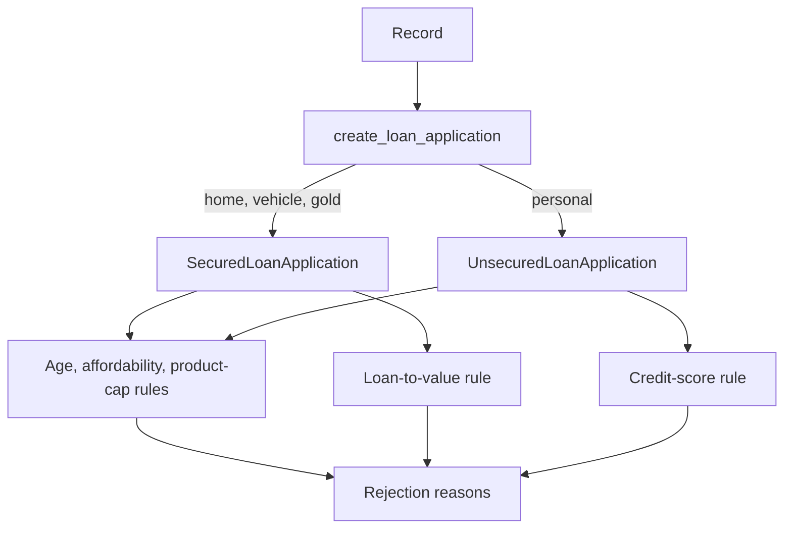

# Core Package

`loanserve.core` contains the lending domain rules and calculations that are shared by the HTTP API, CSV storage loader, risk-model feature engineering, and assistant tools. It does not know about HTTP requests, database sessions, or model-training orchestration.

## How A Loan Is Evaluated

`create_loan_application(record)` normalizes the product type and constructs either a secured or unsecured application. The shared base class validates that the product exists in the configured catalogue, computes the product rate and monthly installment, then checks age, installment-to-income ratio, and product amount cap. Secured loans add a loan-to-value check; unsecured loans add a minimum credit-score check. Eligibility is true only when no rejection reasons are returned.



The catalogue and thresholds are centralized in `config/constants.py`: supported product rates and maximum loan amounts, permitted age range, installment-to-income ceiling, maximum secured loan-to-value, and minimum unsecured credit score. Update policy values there rather than duplicating them in callers.

## Files

| File | Implementation |
| --- | --- |
| `entities.py` | `LoanApplication` owns normalized fields, rate lookup, installment, debt-to-income, shared rejection rules, and eligibility. `SecuredLoanApplication` adds collateral and LTV. `UnsecuredLoanApplication` adds credit-score validation. The factory chooses secured products from `SECURED_LOAN_TYPES`. |
| `loan_calculations.py` | `calculate_monthly_installment()` uses the reducing-balance annuity formula and handles a zero rate as principal divided by term. `calculate_debt_to_income_ratio()` returns installment/income. `build_outstanding_balances()` uses NumPy to compute the balance after every payment, including zero-rate loans. |
| `validators.py` | Validates and canonicalizes PAN (uppercase/trimmed), Indian mobile number (whitespace removed), and email (lowercase/trimmed). Patterns live in `config/constants.py`; failures raise `InvalidApplicationError`. |
| `exceptions.py` | Provides the `LoanServeError` base and domain errors such as `InvalidApplicationError`, `StorageError`, and `UnsupportedLoanTypeError`. |
| `decorators.py` | `reject_negative_arguments` rejects negative positional numeric arguments while preserving wrapped function metadata. `measure_duration` records the latest call duration on `last_duration_seconds`. |
| `__init__.py` | Package marker. |

## Important Contracts

- Amounts are rupees, rates are annual percentages, and tenure is in months.
- Monthly installment is based on a fixed payment and reducing principal balance; a zero-percent rate is supported.
- Debt-to-income is monthly installment divided by monthly income. The configured limit is inclusive at the boundary because only values greater than the maximum are rejected.
- A secured loan with missing/non-positive collateral has an infinite LTV and is therefore ineligible.
- Product types are case-insensitive after trimming. An unsupported type raises `UnsupportedLoanTypeError` during construction.
- The core domain and request schemas are separate: the API schema also validates basic field ranges and required contact data.

## Usage

```python
from loanserve.core.entities import create_loan_application

application = create_loan_application({
    "loan_type": "personal",
    "loan_amount_inr": 500000,
    "tenure_months": 36,
    "monthly_income_inr": 60000,
    "age_years": 32,
    "credit_score": 760,
})

installment = application.monthly_installment_inr()
eligible = application.is_eligible()
reasons = application.rejection_reasons()
```

Run the full focused package coverage from the project root with `python -m pytest -q test.py -k week1_day3` or run all tests with `python -m pytest -q test.py`.
