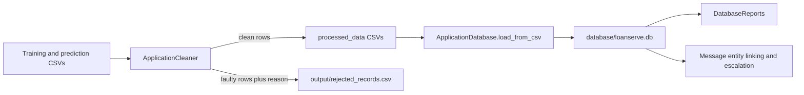

# Data Access Package

`loanserve.data_access` handles movement of application records between CSV files and SQLite. It owns batch cleaning, rejection explanations, data loading, simple SQL reports, and a smaller CSV storage abstraction used by the domain-object examples. It is distinct from `loanserve.api.repository`, which persists applications submitted to the HTTP service.

## Application Data Flow



The cleaner assigns the first applicable rejection reason in this order: duplicate application ID, missing modelling field, non-positive income, unparseable application date, and credit score outside the supported range. Valid rows are normalized, written separately from rejects, and remain traceable to the raw input.

## Files

| File | Implementation |
| --- | --- |
| `cleaning_pipeline.py` | `ApplicationCleaner` reads a raw CSV, computes a per-row fault reason, normalizes surviving date/text/integer fields, and writes clean and rejected CSVs. Its command-line entry point processes both training and prediction datasets. |
| `database_loader.py` | `ApplicationDatabase` uses SQLite directly. It loads a cleaned CSV into `loan_applications`, finds a row by application ID, and deletes by ID. It creates the database parent directory and exposes rows as dictionaries. |
| `database_reports.py` | Runs SQL aggregates for default rate by loan type, annual application volume/amount, and city exposure above a caller-supplied application count. |
| `file_storage.py` | `ApplicationFileStorage` saves/loads CSV records, raises `StorageError` for empty saves or missing files, and converts loaded string-valued rows into secured/unsecured domain objects using the core factory. |
| `__init__.py` | Package marker. |

## Run The Main Stages

Run from the repository root because the entry points use relative paths:

```bash
python -m loanserve.data_access.cleaning_pipeline
python -m loanserve.data_access.database_loader
python -m loanserve.data_access.database_reports
```

Cleaning produces `processed_data/loan_applications_cleaned.csv`, `processed_data/loan_applications_predict_cleaned.csv`, and `output/rejected_records.csv`. The loader consumes the cleaned training file and writes the SQLite table used by reports and message/assistant lookups.

## Data Safety And Dependencies

- `ApplicationDatabase.load_from_csv()` calls `to_sql(..., if_exists="replace")`. Running it replaces the `loan_applications` table; treat it as a rebuild operation, not an append.
- The reports expect the loaded table to contain fields including `loan_type`, `defaulted`, `application_date`, `applicant_city`, and `loan_amount_inr`.
- `ApplicationDatabase` uses parameterized SQL for application-ID lookup and deletion.
- `ApplicationFileStorage` is a separate lightweight CSV utility, not the SQLite application database.
- Cleaning and database loading do not require Gemini credentials. Message linking and assistant lookup depend on the SQLite dataset having been loaded.

The suite checks cleaner invariants and generated files. Run `python -m pytest -q test.py -k week2_day1` for the related subset, or `python -m pytest -q test.py` for the whole suite.
