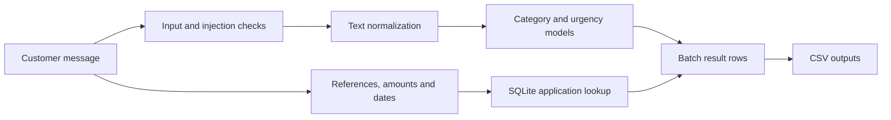

# Message Intelligence Package

`loanserve.message_intelligence` processes customer messages and threads. It provides text normalization, category/urgency classification, safety screening, entity extraction and application linking, extractive thread summaries, escalation reports, and helpers for structured language-model settings/replies.

## Processing Flow



The functions can be used individually or via batch/report entry points. The batch pipeline processes the last 500 records by default, classifies each valid message, extracts references and amounts/dates, links application IDs, and writes processed/failed status. Thread summaries and escalation reports are separate workflows over `message_threads.csv`.

## Files

| File | Implementation |
| --- | --- |
| `text_cleaning.py` | Removes quoted email replies, signatures, greetings and sign-offs; masks URLs and application/ticket references; collapses whitespace and lowercases. `clean_corpus()` adds a `cleaned_text` column. |
| `message_classifier.py` | Trains two TF-IDF word n-gram plus balanced logistic-regression classifiers, one for category and one for urgency. `classify_message()` predicts both labels; the command saves them together in `artifacts/message_classifier.pkl`. |
| `injection_guard.py` | Scans for known instruction override, role reassignment, guardrail suppression, prompt extraction, delimiter smuggling, and data-exfiltration patterns. It includes safe-lookalike exclusions; this is a pattern-based guard, not a general semantic guarantee. The corpus scanner avoids classifying blocked text. |
| `entity_extraction.py` | Extracts unique LA/LP application IDs, rupee amounts prefixed with Rs/INR/₹, and supported date formats. It checks IDs against the SQLite application table and writes rows containing at least one extracted entity. |
| `batch_pipeline.py` | Rejects blank, invalid, corrupted, oversized, or injection-marked messages. For accepted text it combines category/urgency, linked/unlinked references, amounts, and dates. It writes status and failure reason for each selected message. |
| `thread_summary.py` | Cleans and splits thread messages into sentences, vectorizes sentence text with TF-IDF, scores attention received, and selects up to three important sentences while preserving their original order. |
| `escalation.py` | Classifies the first turn of each sampled thread for urgency, infers sentiment with keyword rules, resolves application exposure in SQLite, and escalates at least two signals or very large exposure. |
| `attention.py` | Implements stable softmax, query/key attention scores, and scaled dot-product attention used by sentence ranking. |
| `llm_client.py` | Loads `GEMINI_API_KEY` and `GEMINI_MODEL` from environment or `.env`, defines a JSON prompt, parses/validates required response keys, and provides a SHA-256-keyed disk-cache helper. It does not itself make a Gemini API request. |
| `__init__.py` | Package marker. |

## Inputs And Outputs

Main inputs are `data/customer_messages.csv`, `data/message_threads.csv`, and `data/adversarial_messages.csv`. Outputs include `processed_data/messages_cleaned.csv`, the classifier model in `artifacts/`, and pipeline, entity, thread-summary, injection, and escalation CSV reports in `output/`.

The batch, entity-linking, and escalation paths expect `database/loanserve.db` to contain a `loan_applications` table. Classifier-based paths require the trained classifier artifact. The standalone text cleaner and attention routines do not need the database or Gemini configuration.

## Run Workflows

```bash
python -m loanserve.message_intelligence.message_classifier
python -m loanserve.message_intelligence.text_cleaning
python -m loanserve.message_intelligence.batch_pipeline
python -m loanserve.message_intelligence.thread_summary
python -m loanserve.message_intelligence.entity_extraction
python -m loanserve.message_intelligence.injection_guard
python -m loanserve.message_intelligence.escalation
```

Run the classifier before classifier-dependent commands, and load application data before reference linking or exposure lookup. The Gemini helper requires credentials only when its settings are requested; the above batch scripts do not need a live Gemini API call.
