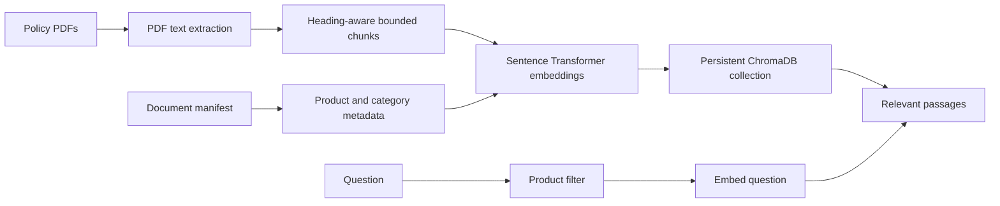

# Retrieval Package

`loanserve.retrieval` builds a searchable index from lending policy PDFs and returns relevant passages with document metadata. It is the evidence-retrieval layer used by assistant policy tools; it does not by itself generate a customer answer.

## Index And Search Flow



Documents are loaded in filename order with `pypdf`. The chunker recognizes section-like headings, joins body text, and splits it into chunks no longer than the configured policy limit without splitting words. Chunk IDs combine document ID and sequence number. The vector store embeds each chunk with `all-MiniLM-L6-v2`, normalizes vectors, and stores them in a cosine-distance ChromaDB collection.

At query time, `filtered_search()` guesses a product from question keywords and searches that product plus universal (`all`) policies. A question without a recognized product searches universal policies. Returned items include chunk ID, text, heading, document ID, and distance.

## Files

| File | Implementation |
| --- | --- |
| `document_loader.py` | Reads all PDFs in a directory and extracts non-empty page text into document-ID/text records. |
| `chunking.py` | Recognizes headings, splits text into `(heading, body)` sections, wraps bodies at the configured character limit, and assigns stable chunk IDs. |
| `vector_store.py` | Loads the Sentence Transformers embedder, opens a persistent ChromaDB collection, joins chunks with manifest metadata, rebuilds the collection, and runs unfiltered semantic search. |
| `filtered_search.py` | Detects home, vehicle, gold, or personal product keywords; builds a Chroma metadata filter that includes universal policies; returns nearest passages. |
| `grounded_answer.py` | Builds a prompt constrained to retrieved passages, extracts chunk citations from a proposed answer, and raises `UngroundedAnswer` if citations are absent or refer to chunks not retrieved. |
| `__init__.py` | Package marker. |

## Build And Use

From the repository root:

```bash
python -m loanserve.retrieval.vector_store
```

This reads `data/policy_documents/` and `data/policy_documents_manifest.json`, then writes the collection to `database/policy_store/`. **The build deletes and recreates the `policy_documents` collection**, so it is a rebuild, not an incremental update. The embedding model may need to be downloaded on first use.

The assistant's `search_policy_documents` tool opens this persistent collection, loads the embedder, and calls `filtered_search()`. It requires the index to exist. `grounded_answer.py` provides citation construction/checking helpers, but the assistant node flow currently does not call those helpers automatically; retrieval and answer-generation responsibilities should not be conflated.

Policy text, metadata, and citation IDs should be kept aligned: the manifest is keyed by PDF stem/document ID, and citations must match the IDs returned from the current search. Retrieval evaluation inputs live in `data/retrieval_evaluation_set.json`.
