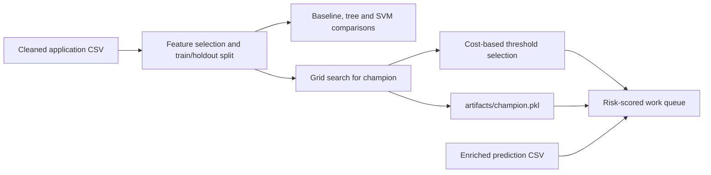

# Risk Models Package

`loanserve.risk_models` prepares application data for machine learning, trains and evaluates default-risk classifiers, chooses an operating threshold, and produces risk scores for applications awaiting review. The target label is `defaulted`; the allowed inputs and model settings are centralized in `config/constants.py`.

## Modeling Flow



The feature pipeline imputes numeric and categorical values, scales numeric values, one-hot encodes categories, and uses the configured random seed and stratified holdout split. The champion search compares logistic regression and random forest using stratified cross-validation and ROC-AUC. The threshold sweep prices missed defaults and refused good applicants with the configured business costs, rather than assuming 0.5 is optimal.

## Files

| File | Implementation |
| --- | --- |
| `feature_pipeline.py` | Builds the scikit-learn `ColumnTransformer` pipeline, selects only configured model fields, and makes reproducible stratified train/holdout partitions. Optional extra feature lists support enriched data. |
| `feature_engineering.py` | Derives monthly installment, installment/income ratio, and credit-score band. Writes enriched train/predict CSVs and compares random-forest fold performance with and without the engineered fields. |
| `baseline_model.py` | Trains a balanced logistic-regression pipeline, evaluates holdout ROC-AUC, serializes models with joblib, predicts default probabilities, and writes application-ID/probability output. It also patches selected scikit-learn compatibility attributes when loading serialized estimators. |
| `tree_models.py` | Defines decision-tree and random-forest pipelines, evaluates holdout ROC-AUC, ranks forest feature importances, and compares class-weighted versus unweighted forests using ROC-AUC and defaulter recall. |
| `champion_model.py` | Grid-searches logistic regression and random forest across configured parameter grids, writes search metrics, saves the best estimator, then sweeps thresholds from 0.05 to 0.95 using the two configured error costs. |
| `cross_validation.py` | Evaluates logistic regression, decision tree, random forest, and linear SVM across stratified folds and writes fold scores, mean ROC-AUC, and spread. Its command-line entry point also prints train/holdout scores. |
| `work_queue.py` | Scores the enriched prediction file with the champion, labels scores at/above the selected threshold `refer` and lower scores `approve`, sorts riskiest-first, and summarizes referred exposure. |
| `__init__.py` | Package marker. |

## Rebuild In Dependency Order

Run from the repository root. Cleaning creates the input files; engineering, training, and queue generation consume them in stages.

```bash
python -m loanserve.data_access.cleaning_pipeline
python -m loanserve.risk_models.feature_engineering
python -m loanserve.risk_models.baseline_model
python -m loanserve.risk_models.tree_models
python -m loanserve.risk_models.champion_model
python -m loanserve.risk_models.cross_validation
python -m loanserve.risk_models.work_queue
```

The work-queue stage specifically needs `artifacts/champion.pkl`, `output/threshold_choice.json`, and `processed_data/loan_applications_predict_enriched.csv`. Training commands can be CPU-intensive; they are not needed just to start the API or check `/health`.

## Outputs

The modules write model files under `artifacts/` (baseline, decision tree, random forest, and champion) and reports/predictions under `output/` (`predictions.csv`, champion search, chosen threshold, fold scores, feature lift, class-weight comparison, and `work_queue.csv`). These outputs are consumed by assistant risk lookup and operational review workflows.

`python -m pytest -q test.py` covers the expected model and report outputs along with their calculations. If a test reports that an artifact is missing, run the module responsible for that artifact before retrying.
